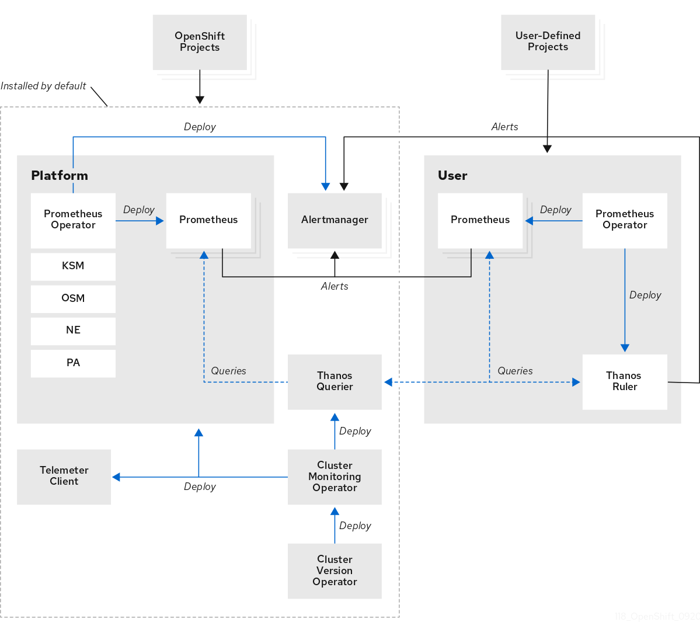
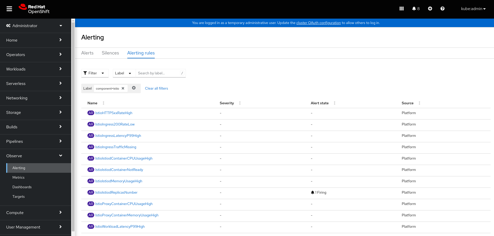

# Openshift Monitoring User-defined Projects

This repository collects information about monitoring applications and services in Openshift 4.11 with the user-defined monitoring stack.

## Monitoring Overview

OpenShift Container Platform includes a preconfigured, preinstalled, and self-updating monitoring stack that provides monitoring for core platform components. You also have the option to enable monitoring for user-defined projects that allows cluster administrators, developers, and other users to specify how services and pods are monitored in their own projects.

The OpenShift Container Platform monitoring stack is based on the Prometheus open source project and its wider ecosystem. The monitoring stack includes the following:



Please visit the following [link](https://docs.openshift.com/container-platform/4.11/monitoring/monitoring-overview.html#understanding-the-monitoring-stack_monitoring-overview) for more information about the monitoring stack in Openshift.


## Configuring User-defined Projects

Cluster administrators can enable monitoring for user-defined projects by setting the *enableUserWorkload: true* field in the cluster monitoring ConfigMap object. Please follow the next steps in order to enable this feature:

- Create cluster monitoring configuration configmap

```$bash
$ oc -n openshift-monitoring apply -f ocp/monitoring-cm.yaml

configmap/cluster-monitoring-config created
```

- Review the pods are running in the openshift-user-workload-monitoring project

```$bash
$ oc -n openshift-user-workload-monitoring get pod

NAME                                   READY   STATUS        RESTARTS   AGE
prometheus-operator-6f7b748d5b-t7nbg   2/2     Running       0          3h
prometheus-user-workload-0             6/6     Running       1          3h
prometheus-user-workload-1             6/6     Running       1          3h
thanos-ruler-user-workload-0           3/3     Running       0          3h
thanos-ruler-user-workload-1           3/3     Running       0          3h
```

Once the pods are running in the openshift-user-workload-monitoring project, it is possible to start using the User-defined Projects monitoring stack.

## Monitoring a Custom Application

It is possible create a **ServiceMonitor** resource to scrape metrics from a service endpoint in a user-defined project. This assumes that the application uses a Prometheus client library to expose metrics to the */metrics* canonical name.

### Deploy the Application

To test monitoring of a service in a user-defined project, it is required to deploy a set of Openshift resources (namespace, service, deployment, etc) following the next steps:

- Create the respective application

```$bash
$ oc apply -f app/app.yaml

namespace/app created
deployment.apps/back-springboot created
service/back-springboot created
route.route.openshift.io/back-golang created
```

- Test the application

```$bash
$ oc get pod -n app

NAME                               READY   STATUS    RESTARTS   AGE
back-springboot-8647f44869-jv6bp   1/1     Running   0          1m

$ URL=$(oc -n app get route back-springboot -o jsonpath='{.spec.host}')
$ curl https://${URL} -k

{"message":"/ - Greetings from Spring Boot!","code":200}

$ curl https://${URL}/metrics -k

...
jvm_threads_live_threads 23.0
# HELP process_files_open_files The open file descriptor count
# TYPE process_files_open_files gauge
process_files_open_files 15.0
```

### Monitor the Application

A ServiceMonitor is a custom resource definition (CRD) that specifies how a service should be monitored, or a PodMonitor CRD that specifies how a pod should be monitored. The former requires a Service object, while the latter does not, allowing Prometheus to directly scrape metrics from the metrics endpoint exposed by a pod.

Once the application is deployed, it is time to create the respective service monitor in order to collect the metrics that are exposing the application.

Please follow the next steps to create the respective service monitor:

- Create the respective service monitor

```$bash
$ cat app/servicemonitor.yaml

$ oc apply -f app/servicemonitor.yaml

servicemonitor.monitoring.coreos.com/prometheus-back-springboot created
```

- Check the service monitor is correctly created in the user-defined Prometheus configuration

```$bash
$ ./scripts/find-monitor-prometheus.sh back-springboot

- job_name: serviceMonitor/app/prometheus-back-springboot/0
    regex: (back-springboot);true
```

Once the service monitor is created, the respective metrics should be found in the Openshift Console (Observe -> Metrics). For example, it is possible to find the *tomcat_sessions_active_current_sessions* metric:


### Alert Application Issues

OpenShift Container Platform monitoring ships with a set of default alerting rules. As a cluster administrator, you can view the default alerting rules.

In OpenShift Container Platform 4.11, you can create, view, edit, and remove alerting rules in user-defined projects.

In the following example, it will be created a Prometheus rule that checks the metric *tomcat_sessions_alive_max_seconds* for the service *back-springboot*. If this metric is equal to 0, an alarm should be fired.

Please follow the next steps to create a custom alert based on a metric in our application:

```$bash
$ cat app/prometheusrule.yaml

$ oc apply -f app/prometheusrule.yaml

prometheusrule.monitoring.coreos.com/example-alert created
```

Once the Prometheus rule is created, the respective alert should be found in the Openshift Console (Observe -> Alerting). For example, it is possible to find the *App1SessionsAlert* alert:


In this case, it is possible to see that this alarm is firing because the metric tomcat_sessions_alive_max_seconds is equal to 0.

NOTE: Please pay special attention to alerting best practices included in the following [link](https://docs.openshift.com/container-platform/4.11/monitoring/managing-alerts.html#Optimizing-alerting-for-user-defined-projects_managing-alerts).


### Notify Alerts (Slack)

In order to be able to send notifications to different receivers when alarms are firing, it is required to follow a set of steps that are collected below.

#### Create a slack configuration

First of all, it is required to create a set of resources in Slack in order to be able to receive notifications. Please check the following prerequisites are met:

- A namespace
- A specific channel in the namespace
- An application 
- An incoming webhook (It is important to save the *Webhook URL* and *channel name* for configuring the Openshift Monitoring Stack)

#### Configure AlertManager

Once the slack resources are created, it is time to configure Alertmanager in Openshift in order to be able to send notifications to the external receivers. In this case, it is required to configure a new one with the following configuration using the Openshift Console (Administration -> Cñuster Settings -> Configuration -> Alertmanager).

For example, it is possible to modify the *Critical* receiver clicking in *Configure*. Please review the following picture that shows the required configuration:


It is important to bear in mind that the previous receiver is using *routing labels* (notifier=slack) in order to identify what fired alarms should be notified using the specific receiver. These labels have to appear in the respective prometheus rule that creates the alarm as shown in the following example:

```$bash
...
    rules:
    - alert: App1SessionsAlert
      expr: tomcat_sessions_alive_max_seconds{job="back-springboot"} == 0
      labels:
        notifier: slack  <----------
``` 

Once the receiver is configured and the alarm is fired, slack receives a new message through the incoming webhook configured:


## Monitoring Red Hat Service Mesh

Red Hat OpenShift Service Mesh addresses a variety of problems in a microservice architecture by creating a centralized point of control in an application. It adds a transparent layer on existing distributed applications without requiring any changes to the application code.

Red Hat OpenShift Service Mesh 2.2 uses Prometheus to store telemetry information from services. Kiali depends on Prometheus to obtain metrics, health status, and mesh topology.

### Metrics

In order to have a centralized point of monitoring, including alarming, is an option to unify Red Hat Service Mesh metrics in the Openshift Monitoring Stack by default. In order to perform this integration, it is required to follow the next steps:

- Grant the required permissions to the Openshift Monitoring stack ServiceAccount for list objects in the Service Mesh Control Plane namespace

```$bash
$ oc policy add-role-to-user view system:serviceaccount:openshift-monitoring:prometheus-k8s -n istio-system
```

- Create a *service monitor* to scrape the respective metrics:

```$bash
$ oc apply -f istio/servicemonitor.yaml
```

Once the service monitor is created and the metrics have been scraped, it is possible to se a new target in the Openshift Console and display some metrics values:

**Prometheus Targets**


**Red Hat Service Mesh Metrics**


## Alerting

Once the Red Hat Service Mesh Prometheus and the Openshift Monitoring Stack Promethus are integrated, it is time to configure the respective alerting. 

For example, it is possible create a set of alarms to monitorng the Red Hat Service Mesh control plane:

- Create a *prometheus rule* to generate the respective alarms:

```$bash
$ oc apply -f istio/prometheusrule.yaml
```

- Review the alarms (Observe -> Alerting -> Alerting Rules -> Search by tag *component: istio*)



It can be clearly seen an alert firing because the number of Istiod replicas is low than 3. Please review the information in the alerting rule area as the picture shows.


Finally, it is important to bear in mind that the fired alerts will trigger a notification in slack due to the label *notifier: slack* defined for every rule.

## Author

Asier Cidon @RedHat